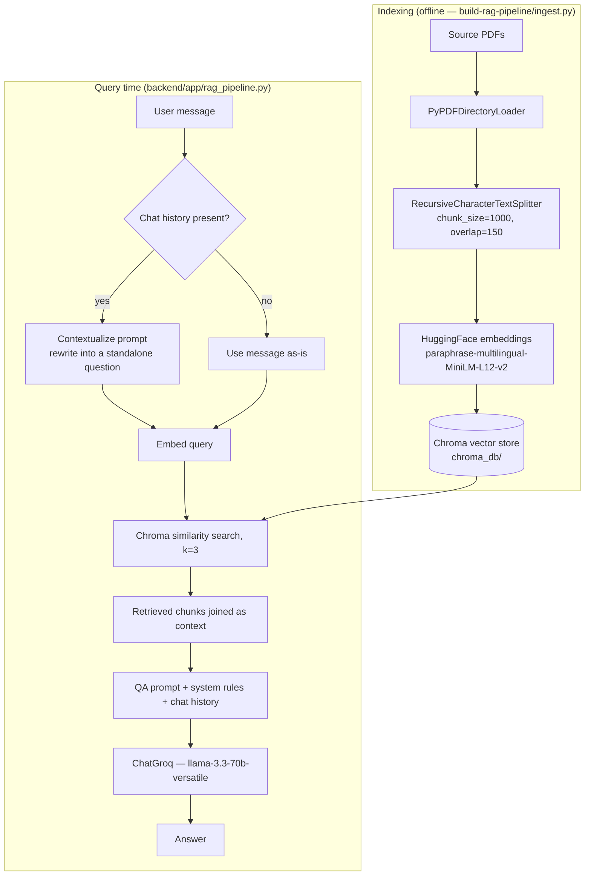

# MediAssist AI — Backend

FastAPI service exposing the RAG chat pipeline, symptom-image analysis, prescription OCR, voice
transcription, and a local medicine lookup. See the [root README](../README.md) for the overall
system architecture and how these pieces fit together with the frontend.

## Layout

```
backend/
├── app/
│   ├── main.py                 API routes
│   ├── rag_pipeline.py         RagPipeline — Chroma + Groq chain, built once at startup
│   ├── vision_ocr.py           Gemini calls for the symptom-image checker and OCR
│   ├── get_medicine_data.py    SQLite (FTS5) queries against the medicine database
│   ├── utils.py                Symptom keyword matching, triage question generation, prompt assembly
│   └── models.py                Pydantic request/response schemas
├── create_db.py                 Original DB-builder script (unchanged from the source project)
├── check_models.py               Lists available Gemini models for the configured API key
├── chroma_db/                    Persisted vector store (see build-rag-pipeline/)
├── medicine_data/medex.db        SQLite medicine database, queried read-only
├── requirements.txt
├── .env.example
└── Dockerfile
```

## Setup

```bash
cd backend
python -m venv venv
source venv/bin/activate          # Windows: venv\Scripts\activate
pip install -r requirements.txt

cp .env.example .env
# fill in GROQ_API_KEY and GEMINI_API_KEY

uvicorn app.main:app --reload --port 8000
```

Confirm it's up at `http://localhost:8000/api/health` — check that `rag_ready` is `true`.
Interactive docs are served at `http://localhost:8000/docs`.

### Environment variables

| Variable | Required for | Notes |
|---|---|---|
| `GROQ_API_KEY` | Chat, triage, voice transcription, medicine overviews | Chain fails to build at startup without it |
| `GEMINI_API_KEY` | Vision symptom checker, OCR extraction | Endpoints return 503 if missing |
| `CHROMA_PATH` | RAG pipeline | Defaults to `./chroma_db`; falls back to `/app/chroma_db` for the Docker layout |
| `FRONTEND_ORIGIN` | CORS | Defaults to `http://localhost:5173` |

## The RAG chain

`RagPipeline` (in `app/rag_pipeline.py`) is constructed once during the app's lifespan and reused
across every request — the embeddings model and vector store are not reloaded per call.

1. **Contextualization** — if there's prior chat history, the latest user message is rewritten into
   a standalone question by the LLM before retrieval (keeps follow-up questions resolvable without
   the user repeating themselves). If there's no history, the raw message is used as-is.
2. **Retrieval** — the (possibly rewritten) query is embedded and matched against Chroma with
   `k=3`.
3. **Generation** — the retrieved chunks, the full chat history, and the system prompt are passed
   to `ChatGroq` (`llama-3.3-70b-versatile`, `temperature=0.3`).

The system prompt (top of `rag_pipeline.py`) is where most of the actual behavior is enforced —
strict language matching (Bengali script in, Bengali script out, no mixing), a reasoning order that
checks for triage/OCR/vision context before asking the user anything else, a ban on inventing
medicine names or dosages, a rule against outright diagnoses, an emergency short-circuit for red-flag
symptom combinations, and a closing disclaimer for any answer touching a serious health concern.

## Symptom triage

Before a chat message reaches the RAG chain, `utils.is_symptom_query` checks it against a bilingual
(Bengali script, Banglish, and English) keyword list. If it matches, the backend calls Groq once to
generate 3–5 structured multiple-choice questions (`utils.generate_triage_questions`) covering
onset, severity, associated symptoms, aggravating/relieving factors, and red flags — and returns
those to the frontend instead of an answer. Once the user answers (or explicitly skips) via
`/api/chat/triage-submit`, the answers are folded into the original message
(`utils.build_triage_answers_block`) and run through the same RAG chain as any other message.

## Medicine database

`get_medicine_data.py` opens `medicine_data/medex.db` read-only and queries an FTS5 virtual table
(`brand_search`) joined against the full record table (`brand_full`) for brand-name search.
Detail records go through `strip_html` to clean up the description fields before being returned —
`dosage_description` is deliberately left as raw HTML since the frontend renders it directly.
`/api/medicine/ai_overview` is the only place an LLM touches this data: it flattens the structured
record into a labeled text block and asks Groq to rewrite it as a plain-language summary in the
requested language.

## Endpoints

| Method | Path | Purpose |
|---|---|---|
| GET | `/api/health` | Backend + RAG readiness check |
| POST | `/api/chat` | Send a chat message — returns either an `answer` or a `triage` question set |
| POST | `/api/chat/triage-submit` | Submit (or skip) triage answers — returns the RAG `answer` |
| POST | `/api/vision/analyze` | Upload a symptom photo (multipart) → Gemini description |
| POST | `/api/ocr/extract` | Upload a prescription/report photo (multipart) → Gemini transcript |
| POST | `/api/voice/transcribe` | Upload recorded audio (multipart) → Groq Whisper transcript |
| GET | `/api/search?q=` | Full-text brand-name search against the medicine database |
| GET | `/api/medicine/{brand_id}` | Full structured record for one medicine |
| POST | `/api/medicine/ai_overview` | Plain-language summary of a medicine record, in the requested language |

## Docker

```bash
docker build -t mediassist-backend .
docker run -p 8000:8000 --env-file .env -v $(pwd)/chroma_db:/app/chroma_db mediassist-backend
```

The image expects `chroma_db/` to be present at build time (`COPY chroma_db ./chroma_db`) or
mounted as a volume at runtime — `docker-compose.yml` at the repo root does the latter.

## Known rough edges

- `vision_ocr.py` hardcodes `gemini-2.5-flash`. If vision/OCR calls start failing with a
  "model not found" error, run `check_models.py` against your API key and swap in whatever's
  currently available.
- The mic recorder on the frontend needs HTTPS or `localhost` to access the microphone — fine for
  local dev, but relevant if you deploy the frontend over plain HTTP.# MediAssist AI

MediAssist AI is a bilingual (Bengali / English) medical information assistant. It combines a
retrieval-augmented chat pipeline with a symptom-image checker, prescription OCR, a local medicine
database, and a set of small clinical utilities (BMI, triage, hospital lookup, emergency numbers)
behind a single React front end.

The project is split into two independently deployable services:

```
mediassist-ai/
├── backend/              FastAPI service — RAG pipeline, vision/OCR, medicine DB, voice
├── frontend/             React (Vite) single-page app
├── build-rag-pipeline/   Standalone script used to (re)build the vector index from source PDFs
└── docker-compose.yml    Runs both services together
```

Each service has its own README with setup details:

- [`backend/README.md`](./backend/README.md)
- [`frontend/README.md`](./frontend/README.md)

---

## Why RAG

A general-purpose LLM answers from what it memorized during training. That's a liability for a
medical assistant — it has no way to ground an answer in a specific, vetted source, and it will
happily produce a fluent but wrong answer. Retrieval-Augmented Generation (RAG) fixes this by
inserting a retrieval step before generation: relevant passages are pulled from a curated
knowledge base first, and the model is instructed to answer from that retrieved text rather than
from memory.

For MediAssist AI this means every chat answer is traceable back to source material in the vector
store, the knowledge base can be extended by dropping in new PDFs and re-indexing (no fine-tuning
or retraining involved), and the model has a much narrower space to hallucinate in.

## Architecture



The two phases are decoupled on purpose: the vector store only needs to be rebuilt when the
underlying medical reference material changes, while every chat request just reads from the
already-persisted `chroma_db`.

### Retrieval and generation, in detail

- **Embeddings** — `sentence-transformers/paraphrase-multilingual-MiniLM-L12-v2`, chosen for
  multilingual coverage (Bengali and English both hit the same knowledge base) and because it runs
  fully local with no per-call API cost.
- **Vector store** — Chroma, persisted to disk so the index survives restarts and is only rebuilt
  when `build-rag-pipeline/ingest.py` is re-run against updated source documents.
- **History-aware retrieval** — if the conversation has prior turns, the latest question is first
  rewritten into a standalone query (same language as the user) before it's embedded and searched.
  This keeps follow-up questions like "and if it doesn't go away?" resolvable without repeating
  context.
- **Generation** — `ChatGroq` running `llama-3.3-70b-versatile` at low temperature (0.3), given the
  retrieved context, the running chat history, and a system prompt that enforces language
  matching, forbids inventing medicine names or dosages, blocks outright diagnoses, and appends an
  emergency directive or a doctor-consult disclaimer depending on how the conversation reads.
- **Symptom triage branch** — before a message ever reaches the RAG chain, it's checked against a
  bilingual keyword list (`is_symptom_query`). If it looks like a symptom report, the backend
  first asks Groq to generate 3–5 structured multiple-choice triage questions (onset, severity,
  associated symptoms, aggravating/relieving factors, red flags) instead of answering immediately.
  The answers the user picks are folded back into the message before it's run through the RAG
  chain, so the final answer is grounded in both the retrieved context and the patient's actual
  reported details.

### Beyond the chat pipeline

Two features sit outside the RAG flow entirely and are worth calling out so the architecture isn't
mistaken for "RAG does everything":

- **Medicine lookup** is a local SQLite database (`medex.db`) queried with FTS5 full-text search —
  no LLM involved in retrieval. An LLM call (Groq) is only used afterward, on request, to turn the
  raw structured record into a plain-language overview.
- **Vision symptom checker and prescription OCR** call Gemini directly on the uploaded image. These
  are single-turn, stateless calls that return a description or transcript, which the user can then
  feed into the chat as additional context (`[Visual Symptoms]` / `[OCR Prescription]` blocks that
  the RAG system prompt is explicitly instructed to read and use).

## Tech stack

| Layer | Choice |
|---|---|
| Backend framework | FastAPI |
| LLM (chat + triage + medicine summaries) | Groq — `llama-3.3-70b-versatile` |
| Vision + OCR | Google Gemini — `gemini-2.5-flash` |
| Voice transcription | Groq Whisper — `whisper-large-v3-turbo` |
| Vector store | Chroma (local, persisted to disk) |
| Embeddings | HuggingFace `paraphrase-multilingual-MiniLM-L12-v2` |
| Orchestration | LangChain (`langchain-core`, `langchain-groq`, `langchain-community`) |
| Medicine database | SQLite with an FTS5 virtual table for brand-name search |
| Frontend | React 18 + Vite, MUI components layered with Tailwind utility classes |

## Running everything together

```bash
# from the repo root, with GROQ_API_KEY and GEMINI_API_KEY available in your shell
docker compose up --build
```

This builds and starts both containers:

| Service | URL |
|---|---|
| Backend API | http://localhost:8000 |
| Frontend | http://localhost:5173 |

`docker-compose.yml` mounts `backend/chroma_db` as a volume, so a pre-built index is picked up
without being baked into the image. For local development without Docker, follow the setup steps
in the backend and frontend READMEs individually — the two run as ordinary standalone processes.

## Rebuilding the knowledge base

The vector store isn't generated at request time — it's built once (or whenever source material
changes) by the ingestion script:

```bash
cd build-rag-pipeline
pip install langchain-community langchain-text-splitters langchain-huggingface chromadb pypdf sentence-transformers
python ingest.py
```

See [`build-rag-pipeline/README.md`](./build-rag-pipeline/README.md) for the full breakdown of the
chunking and indexing choices. The resulting `chroma_db/` folder is what `backend/app/rag_pipeline.py`
loads at startup — copy or mount it into `backend/` before running the API.

## API surface

Full endpoint documentation lives in the backend README; the interactive Swagger UI is also
available at `http://localhost:8000/docs` once the backend is running.

## Notes worth knowing before deploying

- The RAG pipeline requires `GROQ_API_KEY` to initialize at startup — `/api/health` reports
  `rag_ready: false` if it failed to load, most commonly because `chroma_db` wasn't found.
- Vision and OCR endpoints require `GEMINI_API_KEY`; they return a 503 if it's missing rather than
  failing silently.
- This is an informational assistant, not a diagnostic tool — the system prompt is deliberately
  constrained to avoid issuing diagnoses and to escalate to emergency guidance when the reported
  symptoms warrant it.