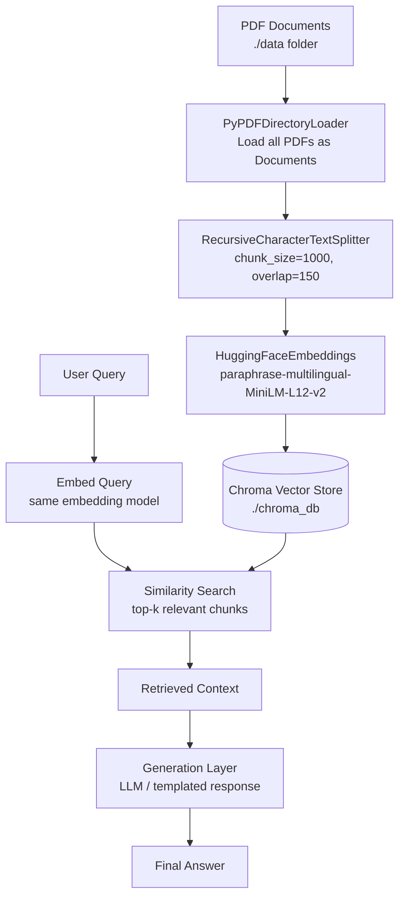

# RAG Retrieval Architecture

A local, folder-based **Retrieval-Augmented Generation (RAG)** pipeline that indexes a directory of PDF documents into a vector database for semantic search. Built with LangChain, HuggingFace embeddings, and Chroma.

---

## What is RAG?

A standalone LLM answers only from what it memorized during training — it has no knowledge of documents specific to a use case, and it can hallucinate facts. **RAG** solves this by adding a retrieval step before generation:

> Instead of asking a model a question and hoping it remembers correctly, the relevant passages are first **retrieved** from a document collection, and the model generates an answer grounded in that retrieved text.

This makes answers:
- **Traceable** — every answer can be linked back to a specific document/page.
- **Up-to-date** — the knowledge base is updated by adding files, no retraining required.
- **Domain-accurate** — grounded in the actual source material instead of general pretraining knowledge.

---

## Architecture Overview



**Two phases:**
- **Indexing phase** (offline, run once or whenever source files change) — steps A → E.
- **Query phase** (runtime, on every user query) — steps F → K.

---

## Components

### 1. Document Loading — `PyPDFDirectoryLoader`
```python
pdf_loader = PyPDFDirectoryLoader(pdf_folder_path)
all_documents = pdf_loader.load()
```
- Recursively loads every PDF in a target folder.
- Each **page** becomes a separate `Document` object, with metadata (source filename, page number) attached automatically.

| Property | Value |
|---|---|
| Input | Folder of `.pdf` files |
| Output | List of `Document` objects (one per page) |
| Metadata retained | filename, page number |

### 2. Text Chunking — `RecursiveCharacterTextSplitter`
```python
text_splitter = RecursiveCharacterTextSplitter(
    chunk_size=1000,
    chunk_overlap=150
)
chunks = text_splitter.split_documents(all_documents)
```
- Full pages are too large and topically diffuse to embed well — splitting into smaller chunks improves retrieval precision.
- **`chunk_size=1000`** — roughly 150–200 words per chunk.
- **`chunk_overlap=150`** — each chunk shares its last 150 characters with the next, preventing key sentences from being cut across a chunk boundary.
- "Recursive" splitting tries paragraph breaks first, then sentences, then words, falling back to a hard cut only as a last resort — keeping chunks semantically coherent.

### 3. Embedding Model — `HuggingFaceEmbeddings`
```python
embedding_model = HuggingFaceEmbeddings(
    model_name="sentence-transformers/paraphrase-multilingual-MiniLM-L12-v2"
)
```
- Converts each chunk into a 384-dimension dense vector representing its meaning.
- The multilingual variant supports 50+ languages, useful when source documents or queries span multiple languages.
- The **same model** must embed both documents and queries — otherwise vectors don't live in a comparable space and similarity search breaks.

| Property | Value |
|---|---|
| Model | `paraphrase-multilingual-MiniLM-L12-v2` |
| Vector dimensions | 384 |
| Language support | Multilingual |
| Runs on | CPU or GPU, fully local (no API cost) |

### 4. Vector Store — `Chroma`
```python
vector_db = Chroma.from_documents(
    documents=chunks,
    embedding=embedding_model,
    persist_directory=persist_directory
)
```
- Stores each chunk's vector, original text, and metadata together.
- `persist_directory` writes the database to disk so embeddings are computed once and reused across restarts.
- Chroma indexes vectors so "find the k most similar chunks" queries stay fast even at scale.

### 5. Retrieval (query time)
```python
retriever = vector_db.as_retriever(search_kwargs={"k": 4})
relevant_chunks = retriever.invoke(user_question)
```
- The query is embedded with the same embedding model.
- Chroma returns the top-k most semantically similar chunks, each with source/page metadata.

### 6. Generation Layer
Whatever generates the final answer (a local LLM, hosted API model, or templated/extractive response) should receive the retrieved chunks as context and be instructed to answer **only** from that context — ideally citing the source document/page — to keep answers grounded rather than freely generated.

---

## Design Rationale

| Choice | Reason |
|---|---|
| Folder-level PDF loading | Index an entire document collection in one call |
| `chunk_size=1000` / `overlap=150` | Balances context richness against embedding precision; overlap protects sentence continuity |
| Multilingual embeddings | Handles mixed-language source material without extra pipelines |
| Chroma with `persist_directory` | Free, local, no external DB server; persists across runs |

---

## Project Structure
```
project/
├── data/                   # Source PDF documents
├── chroma_db/              # Persisted vector database (auto-generated)
├── ingest.py               # Indexing script
└── README.md
```

---

## Setup

```bash
pip install langchain-community langchain-text-splitters langchain-huggingface chromadb pypdf sentence-transformers
```

Place PDF files in the source folder, then run the ingestion script. On completion, the vector database directory will contain the searchable index.

---

## Possible Extensions
- A query script wrapping the retrieval + generation steps into a callable function or API endpoint.
- Source citation in responses (document name + page number from chunk metadata).
- Hybrid search (keyword + vector) for cases needing exact-match precision alongside semantic similarity.
- A re-ranking step after retrieval to improve top-k relevance.